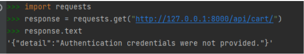
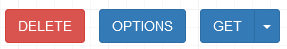

# Django Rest Framework

Установим Django restframework

```
pip install djangorestframework
```

Внесём изменения в `settings.py` и добавим `'rest_framework'` 
в установленные приложения `INSTALLED_APPS`

```python
INSTALLED_APPS = [
    #,
    'rest_framework',
]
```

## 1. API - Просмотр. Обработка get запросов

Сделаем функциональность просматривать корзину покупок для авторизированных 
пользователей при помощи запросов api

В приложении `cart` создадим файл `serializers.py` в котором будем описывать 
сериализаторы для приложения.

Заполним его данным кодом

```python
from rest_framework import serializers
from .models import CartItem


class CartSerializer(serializers.ModelSerializer):
   class Meta:
       model = CartItem
       fields = '__all__'
```

Во `views.py` приложения `cart` добавим отображения для `ViewSet`

```python
from rest_framework import viewsets
from rest_framework.permissions import IsAuthenticated
from .serializers import CartSerializer


class CartViewSet(viewsets.ModelViewSet):
  queryset = CartItem.objects.all()
  serializer_class = CartSerializer
  permission_classes = (IsAuthenticated,)


  def get_queryset(self):
      return self.queryset.filter(cart__customer=self.request.user)
```

В файле `urls.py` приложения `cart` пропишем маршрутизацию

```python
from .views import CartViewSet
from rest_framework import routers

router = routers.DefaultRouter()
router.register(r'cart', CartViewSet)
```

Зарегистрируем данный маршрут в корневом `urls.py` папки project

```python
from cart.urls import router as cart_router

urlpatterns = [
    #,
    path('api/', include(cart_router.urls)),
]
```

Теперь если пользователь авторизирован достаточно перейти 
по пути http://127.0.0.1:8000/api/cart/ и появится форма с отображением данных корзины


Чтобы проверить что действительно запрос работает и данные выводятся, 
то добавьте пару продуктов в корзину того пользователя под которым сидите 
(для этого есть POST форма) и повторите api запрос. RestFrameWork уже под капотом 
обладает рядом функционала CRUD (добавление, удаление, изменение), 
так что даже в таком функционале можно проводить разные действия. 

Но далее рассмотрим где и что необходимо переопределить если нужно написать самостоятельно.

В python console пишем

```python
import requests
response = requests.get("http://127.0.0.1:8000/api/cart/")
response.text
```


Отправим в заголовках свои авторизационные данные. Мы используем самый 
примитивный способ авторизации где будут передаваться авторизационные данные. 
Обычно используют токен для доступа к api

(Для ознакомления)
```
response = requests.get("http://127.0.0.1:8000/api/cart/", auth=(<login>, <password>))
```
Так как сидим под админом, то в нашем случае будет
```python
response = requests.get("http://127.0.0.1:8000/api/cart/", auth=("admin", "123"))
response.text
```

Теперь `response.text` выдаёт нужные данные (товары в корзине)

API на работоспособность извне мы проверили.

Вообще для простого взаимодействия с БД можно не прописывать действия по созданию, 
чтению, обновлению, удалению элементов. Но если планируется сложное взаимодействие 
с БД или другими частями кода, то будет необходимость в переписывании 
базовых методов под вашу задачу.

Допустим, так как при добавлении продукта, мы хотим реализовать механизм увеличения
количество товара при добавлении товара, что есть в корзине.

## 2. API - Добавление. Обработка post запросов

Переопределим возможность добавлять продукты в корзину через API (для своих нужд). 
На данный момент при добавлении одного и того же продукта в корзину через API 
просто создаётся новая строка в БД, а допустим хочется, чтобы количество 
одинаковых товаров суммировались и не создавалась новая строка в БД, 
а заменялась старая.

За `POST` методы отвечает метод `create`


Во `views.py` приложения `cart` добавим `response` из `rest_framework` 
который необходим для отправки сообщений на сторону пользователя, а также 
метод `get_object_or_404`

```python
from rest_framework import response
from django.shortcuts import get_object_or_404
```

В `CartViewSet` во `views.py` приложения `cart` необходимо добавить переопределение метода 
`create`

```python
def create(self, request, *args, **kwargs):
  cart_items = self.get_queryset().filter(product__id=request.data.get('product'))
  # request API передаёт параметры по названиям полей в БД, поэтому ловим product
  if cart_items:  # Если продукт уже есть в корзине
      cart_item = cart_items.first()
      if request.data.get('quantity'):  # Если в запросе передан параметр quantity,
          # то добавляем значение к значению в БД
          cart_item.quantity += int(request.data.get('quantity'))
      else:  # Иначе просто добавляем значение по умолчению 1
          cart_item.quantity += 1
  else:  # Если продукта ещё нет в корзине
      product = get_object_or_404(Product, id=request.data.get('product'))  # Получаем продукт и
      # проверяем что он вообще существует, если его нет то выйдет ошибка 404
      cart = get_object_or_404(Cart, id=request.data.get('cart')) # Получаем корзину
      if request.data.get('quantity'):  # Если передаём точное количество продукта, то передаём его
          cart_item = CartItem(cart=cart,
                               product=product,
                               quantity=request.data.get('quantity'))
      else:  # Иначе создаём объект по умолчанию (quantity по умолчанию = 1, так прописали в моделях)
          cart_item = CartItem(cart=cart,
                               product=product)
  cart_item.save()  # Сохранили объект в БД
  return response.Response(
      {'message': 'Продукт успешно добавлен в корзину'},
      status=201,
  )  # Вернули ответ, что всё прошло успешно
```


Обратите внимание, что параметры которые мы получаем в запросе чаще будут называться 
как поля в БД (во всяком случае если создавать post запрос из restframework)

Теперь попробуем отправить данные через форму rest_framework

Зайдём на адрес http://127.0.0.1:8000/api/cart/ и пролистаем вниз там будет возможность 
отправлять post запросы 

В виде “сырых” данных


В виде данных полученных с формы, там ещё добавляется CSRF токен


Осталось только проверить работу из другой точки (допустим requests), что api работает извне.

Откроем Python консоль в которой работали ранее.

Создадим данные которые будем передавать

```python
data = {"quantity": 12, "cart": 1, "product": 11}
response = requests.post("http://127.0.0.1:8000/api/cart/", auth=('admin', 123), json = data)
response.status_code
response.text
```


## 3. API - Обновление. Обработка put запросов

Далее рассмотрим обновление данных в корзине

Если перейти по адресу http://127.0.0.1:8000/api/cart/1/ 
То выведется ответ на get запрос, однако вернётся информация по первой строке в корзине. 

Но теперь уже будет доступно больше кнопок, и соответственно больше методов с помощью которых можно отправить запросы.

Наверху добавилась кнопка `DELETE`



А внизу вместо POST появились кнопки PUT и PATCH


Что соответствует принципу REST в части единственности интерфейса

во `views.py` в `CartViewSet` допишем

```python
def update(self, request, *args, **kwargs):
    # Для удобства в kwargs передаётся id строки для изменения в БД, под параметром pk
    cart_item = get_object_or_404(Cart, id=kwargs['pk'])
    if request.data.get('quantity'):
        cart_item.quantity = request.data['quantity']
    if request.data.get('product'):
        product = get_object_or_404(Product, id=request.data['product'])
        cart_item.product = product
    cart_item.save()
    return response.Response({'message': 'Данные объекта корзины изменены'},
                             status=201)
```

Проведите обновление товара в `HTML form` или `Raw data`.

Для текущих задач нет необходимости переопределять `update` так как нет необходимости 
в изменении логики как в `create`, но для понимания было сделано переопределение `update`

Через requests делается всё аналогично
```python
response = requests.put("http://127.0.0.1:8000/api/cart/1/", auth=('admin', 123), json = data)
```
где data - словарь с данными для обновления

## 4. API - Удаление. Обработка delete запросов

Для удаления необходимо переопределить метод `destroy`

Во `views.py` класса `CartViewSet`

```python
def destroy(self, request, *args, **kwargs):
    # В этот раз напишем примерно так как это делает фреймфорк самостоятельно
    cart_item = self.get_queryset().get(id=kwargs['pk'])
    cart_item.delete()
    return response.Response({'message': 'Продукт успешно удалён из корзины'},
                             status=201)
```

Через браузер делается всё довольно просто


Через requests делается всё аналогично, однако передаваемых данных уже нет (удалите какой-нибудь товар,
через requests)

```python
response = requests.delete("http://127.0.0.1:8000/api/cart/6/", auth=('admin', 123))
```

На примере 4-ех действий было показано работа с GET, POST, PUT, DELETE методами.
Но для конкретной задачи необходимо было переопределить только `create` так как 
только POST запрос менял стандартную логику. update и destroy методы были 
приведены только для примера как их переопределять.

# Практика закончена

# Дополнительное (необязательное) задание

Ранее вы делали(кто делал) избранное на данном интернет магазине. Попробуйте реализовать 
api избранное.