# Тестирование элементов API

Для тестирования скопируем файл `tests.py` из `files/lab4` в приложение `cart` с заменой

В приведенном коде сразу тестируется сериализатор и обработчики нашего API

Объяснение некоторых моментов после картинок. На лекции было показано 
как проводить тестирование через объект клиента 
(self.client.get(url), self.client.put(url, data), self.client.delete(url)), 
а сейчас приведён пример тестирование через класс отображение API. Видно, что 
при работе с классом отображения API мы вызываем .as_view, как у обычного класса 
отображения, однако передаём туда словарь с методом HTTP и методом класса который 
будет его обрабатывать.

Можно обратить внимание, что в setUp каждого нашего класса 
(вспомните зачем нужен setUp из модуля unittest, он нужен чтобы для каждого класса 
были одни данные для тестов на протяжении существовании тестового класса, 
мы также помним, что setUp должен быть по факту классовым методом, 
соответственно обернут декоратором @classmethod, но также помним как работает 
python, что для него главное чтобы первый параметр в методе ссылался на класс, 
что формально выдерживается, так что даже так всё будет работать нормально)

Специфика тестов в Django такая, что при каждом глобальном запуске тестов, 
создаётся новая БД с названием “test_<название вашей БД>” со всем необходимыми 
таблицами, но они пустые, поэтому при каждом запуске тестового файла (если в 
тестовом файле создали функцию setUpModule в котором прописали общие данные на 
тестовый модуль) тестового класса (если в тестовом классе создали метод setUpClass 
в котором прописали общие данные на тестовый класс) или теста (метод setUp в 
котором пропишете какие данные будут создаваться при каждом запуске теста в классе).

`Любые действия что были с БД в момент теста полностью исчезают после завершения 
данного теста, это специфика работы тестов в Django.` 

Например в одном тесте вы добавили нового пользователя в БД (это был тест 
на проверку добавления пользователя), допустим следующий тест который 
запускается, это проверка удаления пользователя, вы пытаетесь удалить 
прошлого пользователя, чтобы был создан на предыдущем тесте, но это не выходит, 
так как при завершении прошлого теста -  БД вернулась к первоначальному состоянию 
в котором была до начала прошлого теста, иными словами на каждый тест БД 
возвращается к какому-то базовому состоянию.

Для запуска тестов в консоли пропишите

```python
python manage.py test cart
```

Можно заметить, что БД сначала создаётся (продолжительное время), 
потом проходят тесты, потом она уничтожается.

Если вызвать 
```python 
python manage.py test
```
, то ничего не изменится, просто запустятся
все тесты, которые написаны пока для приложения `cart`. Если было бы необходимо 
запускать все тесты в проекте, то просто не указываем конкретное приложение 
в котором Django будет искать тесты.

Тесты должны пройти без ошибок осталось только разобраться, как были созданы эти тесты,
в tests.py в комментариях описано что и зачем.

Если по каким-то причинам обязательно необходимо, чтобы данные в БД сохранялись 
между сессиями, то можно воспользоваться параметрами при запуске `test --keepdb`
Эта опция сохраняет тестовую базу данных между несколькими запусками.

# Работа с фикстурами

Когда необходимо перед тестами создать БД, 
которая будет хоть как-то заполнена и чтобы это не делать в каждом тесте, 
то можно создать фикстуры на базе которых будут заполняться тестовые БД, 
как мы уже поняли в момент теста БД полностью пустая и после каждого теста 
БД будет откатываться к состоянию которое было определено на момент начало 
данного теста.

Чтобы создать фикстуры, то необходимо:

1. Создать директорию(папку) `fixtures` внутри приложения `cart`, если она 
еще не существует.

2. В директории `fixtures` создаётся файл с именем, например, 
`testdata.json` (или любое другое имя с расширением .json), и 
заполняется данными фикстуры в формате JSON. В нашем случае необходимо скопировать
файл `testdata.json` из `files/lab4` в `cart/fixtures`.

3. В для работы с транзакциями используется `TransactionTestCase`, 
однако базовый `TestCase` включает его в себя, так что ничего менять не придётся. 
Используйте атрибут `fixtures` для указания имени файла фикстуры в вашем тестовом случае.

`fixtures = ['testdata.json']`

В итоге тестовый файл `test.py` приложения store будет выглядеть (ниже приведены изменения)

```python
class CartViewSetTestCase(TestCase):
    """
    Тестирование объекта CartViewSet

    При тестировании проверяем правильность создания объектов, а также
    правильность отрабатывания методов:
        create (test_create_cart_item),
        update (test_update_cart_item),
        delete (test_delete_cart_item).
    """
    fixtures = ['testdata.json']
    def setUp(self):
        """
        Инициализация параметров перед запуском каждого теста (Django очищает БД
        перед каждым тестом, поэтому в начале каждого теста создаются данные
        необходимые для теста)
        """

        # Создание объекта моделирующего отправление запроса
        self.factory = APIRequestFactory()

        # Создание тестового пользователя
        self.user = User.objects.first()
        self.product = Product.objects.first()
    
    # Остальные методы без изменений
        
    def test_delete_cart_item(self):
    # ... то, что было записано ранее
    self.assertEqual(CartItem.objects.count(), 1)  # Ранее было 0, но теперь 1,
    # так как в фикстуре создали один объект в корзине
    
```

```python
class CartSerializerTestCase(TestCase):
    """
    Пример проверки сериализатора
    """
    fixtures = ['testdata.json']
    def setUp(self):
        self.user = User.objects.first()
        self.product = Product.objects.first()
        self.cart = Cart.objects.first()
        self.cart_item = CartItem.objects.first()
```

Теперь при запуске всё должно работать как и ранее, а кода стало меньше.

Атрибуты создаваемые в setUp были оставлены, чтобы не изменять большую часть кода. 
Но теперь можно увидеть, что мы берём значения из БД.

Как вы могли заметить, fixtures это итерируемый объект, а значит вы можете 
создавать такую БД как захотите, с такими исходными данными которые нужны, 
вплоть до каждого теста.

Теперь при запуске тестов Django загрузит данные из фикстуры `testdata.json` в 
тестовую базу данных перед запуском каждого тестового случая.

Обратите внимание, что при использовании фикстур у вас должна быть согласованность 
между данными в фикстуре и вашими моделями. Если вы вносите изменения 
в модели, убедитесь в обновлении соответствующих данных в фикстуре.

# Практика окончена

# Задание по желанию (развертка проекта на сервисе render)

Развертка проекта на сервисе рендер отличается от pythonanywhere, так как
предоставляет подключение к более продвинутым сервисам (БД PostgreSQL 
с возможностью подключения из локального проекта и БД Redis часто используемая, 
как система кеширования), но и имеет более жесткие ограничения на использование.

## 1. Подготовка

Нужно установить сервер приложений gunicorn в локальном проекте, так как на render
будем запускать данный сервер приложений, а не стандартный WSGI Django.

```
pip install gunicorn
```

Затем установим [WhiteNoise](https://whitenoise.readthedocs.io/en/latest/) который 
поможет при развёртке на render.com, так как в обычном режиме нет возможности 
настроить сервер для работы со [статическими файлами](https://docs.render.com/deploy-django#static-files) 
на сервисе render.com.

```
pip install whitenoise
```

`WhiteNoise` - это статический файловый хостинг для веб-приложений Django, 
предназначенный для обслуживания статических файлов (например, CSS, JavaScript, 
изображения) непосредственно из приложения Django, без необходимости настройки 
отдельного веб-сервера для обслуживания статических файлов.

Когда в Django установлен режим DEBUG=True, Django автоматически обслуживает 
статические файлы, что упрощает разработку веб-приложений, так как вы можете 
видеть изменения в статических файлах без необходимости настройки веб-сервера. 
Однако, в производственной среде, когда DEBUG=False, Django больше не обслуживает 
статические файлы из-под капота.

Здесь и приходит на помощь WhiteNoise. WhiteNoise предоставляет WSGI-совместимую 
middleware для обслуживания статических файлов в производственной среде, даже 
при установленном DEBUG=False. Это позволяет обслуживать статические файлы 
прямо из вашего приложения Django, что может быть удобно для небольших проектов 
или случаев, когда нет необходимости или возможности настраивать отдельный 
веб-сервер для обслуживания статических файлов.

WhiteNoise также предоставляет возможность сжатия статических файлов и кэширования, 
что помогает оптимизировать производительность вашего веб-приложения, 
ускоряя загрузку статических ресурсов для пользователей.

Важно отметить, что в более сложных производственных сценариях, особенно при 
высоких нагрузках, настройка отдельного веб-сервера (например, Nginx или Apache) 
для обслуживания статических файлов может быть предпочтительнее, так как такие 
серверы имеют более мощные функции и возможности для оптимизации и кэширования 
статических ресурсов. WhiteNoise лучше всего подходит для простых проектов или 
ситуаций, где нет необходимости настраивать дополнительный веб-сервер.

Далее подправим код в `settings.py`, чтобы была возможность подключить WhiteNoise 
и осталась обратная совместимость с pythonanywhere.

В `MIDDLEWARE` после `'django.middleware.common.CommonMiddleware',` поставьте
`'whitenoise.middleware.WhiteNoiseMiddleware',`

```python
MIDDLEWARE = [
    # остальные строки
    'django.middleware.common.CommonMiddleware',
    'whitenoise.middleware.WhiteNoiseMiddleware',
    # остальные строки
]
```

Нужно немного поменять логику папок со статическими файлами в settings.py

```python
STATIC_URL = 'static/'
if DEBUG:  # Настройка для дебага
    if 'localhost' in ALLOWED_HOSTS:
        # Работаем на 'localhost'
        STATICFILES_DIRS = [os.path.join(BASE_DIR, 'static')]
    else:
        STATIC_ROOT = os.path.join(BASE_DIR, 'static')
else:  # Настройка для production
    STATIC_ROOT = os.path.join(BASE_DIR, 'static')
    STATICFILES_STORAGE = 'whitenoise.storage.CompressedManifestStaticFilesStorage'
```

Затем сделаем возможность в случае запуска дебаг режима на сервисе подгружать 
статические файлы при помощи Django. Для этого в urls.py корневого приложения 
пропишем

```python
from django.contrib.staticfiles.urls import staticfiles_urlpatterns

if DEBUG:
    # код, что тут был 
    urlpatterns += staticfiles_urlpatterns()
```

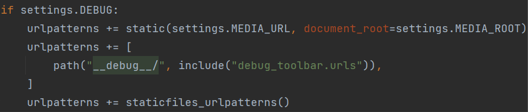

staticfiles_urlpatterns() используются для включения обработчика URL-адресов 
статических файлов в URL-конфигурацию вашего Django-приложения.

При разработке в режиме отладки (DEBUG=True) Django может обслуживать статические 
файлы автоматически, не требуя настройки веб-сервера. Однако, для того чтобы 
правильно обслуживать статические файлы, Django нужно указать, как обрабатывать 
URL-адреса статических файлов.

Однако, обратите внимание, что staticfiles_urlpatterns() должна использоваться 
только в режиме отладки (DEBUG=True). В рабочей среде вы обычно будете 
использовать отдельный веб-сервер (например, Nginx или Apache), чтобы 
обслуживать статические файлы, а не полагаться на Django для обработки 
статических файлов.

`WhiteNoise` будет помогать раздавать статику для режима production(debug=False),
а вот с раздачей медиафайлов куда сложнее. Django может раздавать медиафайлы только в режиме разработки (debug=True), 
в производственном режиме нет такой функциональности. 
Для раздачи в производственной среде обычно используют один из подходов:

* раздача медиафайлов из хранилища непосредственно на сервере, в этом случае за это 
ответственен сам сервер (Nginx, Apache)


* раздача медиафайлов через внешние хранилища (Yandex Object Storage, 
Amazon S3 - Cloud Object Storage, MinIO s3 и т.д.)

В нашем случае для упрощения не будем работать с этими сервисами и в производственном 
режиме наши картинки продуктов не будут отображаться, но статика будет. 
В дебаге всё будет отображаться нормально.

## Обязательная замена

Замените часть файлов css и js, так как выяснилось, что там не хватает пару элементов.

Из files/lab4 скопируйте (с заменой файлов, там только те файлы, что нужно заменить)
`login` в `app_login/static`, а `store` скопируйте в `store/static` 


## 2. Регистрация на render.com

Далее зарегистрируемся на https://dashboard.render.com/login 

Проще будет зарегистрироваться через github

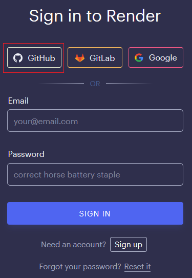


## 3. Создание и подключение БД PosgreSQL

Создадим БД на сервисе, для этого нажимаем на New + и выбираем PostgreSQL

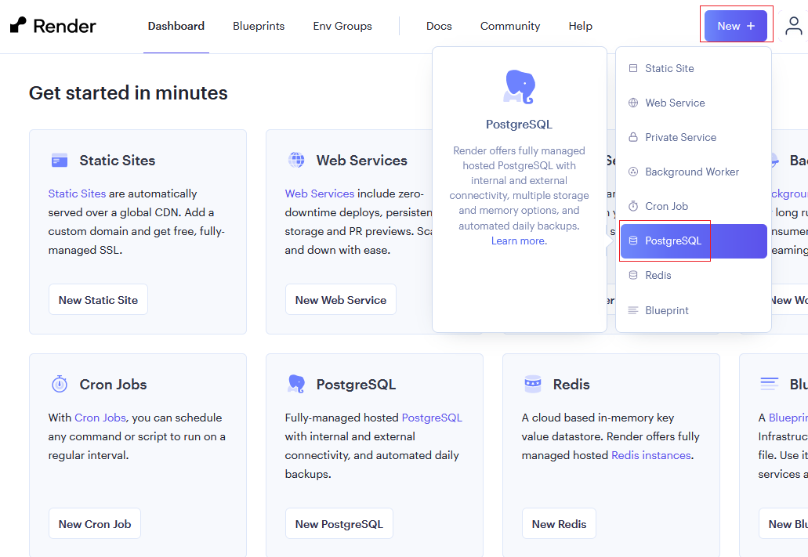

Заполняем данные

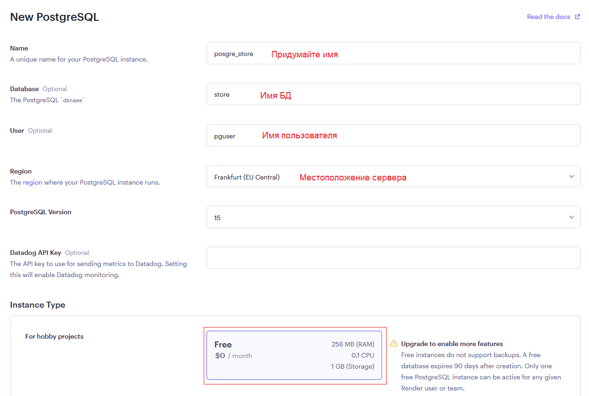

Далее создаём БД нажав на `Create Database`

Ждём пока создастся БД (может занять несколько минут, можно перезагрузить страницу, 
через некоторое время, чтобы проверить доступность), затем листаем вниз до 
блока `Connections`, где будут данные для подключения к БД.

Так как будем подключаться к Posgre, то в `template.env` и `.env` нашего приложения добавим
следующие строки

```python
NAME_PGDB=
USER_PGDB=
PASSWORD_PGDB=
HOST_PGDB=
PORT_PGDB=
```

Затем заполним данные (ваши данные, так как они будут отличаться) 
из блока `Connections` нашей Posgre

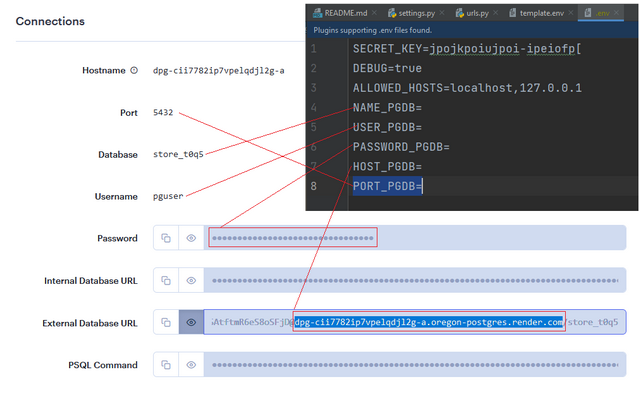

В `HOST_PGDB` обязательно перенести Hostname с адресом сервера, так как будем 
подключаться из вне.

Затем выполняем перенос БД, для этого нужно получить данные из нашей SQLite БД 

```python
python -Xutf8 manage.py dumpdata --exclude=cart.Cart --indent 2 --output=data.json
```

Исключение определенной таблицы необходимо из-за специфики созданных нами ранее 
связи таблицы Cart и User (При создании пользователя автоматически создаётся корзина)

Опция `-Xutf8` устанавливает кодировку по умолчанию в UTF-8 для интерпретатора Python. 
Это особенно полезно при работе с символами Unicode, чтобы избежать проблем, связанных с кодировкой.

Теперь в data.json наша база данных

Затем эти данные необходимо перенести в новую БД(PostgreSQL).

Для этого установим драйвер для подключения к PosgreSQL

```
pip install psycopg2
```

Затем в settings.py в DATABASES допишем подключение к PosgreSQL, подключение к
sqlite3 просто закомментируем

```python
DATABASES = {
    # 'default': {
    #     'ENGINE': 'django.db.backends.sqlite3',
    #     'NAME': BASE_DIR / 'db.sqlite3',
    # },
    'default': {
        'ENGINE': 'django.db.backends.postgresql',
        'NAME': os.getenv('NAME_PGDB'),
        'USER': os.getenv('USER_PGDB'),
        'PASSWORD': os.getenv('PASSWORD_PGDB'),
        'HOST': os.getenv('HOST_PGDB'),
        'PORT': os.getenv('PORT_PGDB'),
    }
}
```

Миграционные файлы у нас уже есть, поэтому `makemigrations` прописывать не нужно,
но вот схему перенести нужно, поэтому выполняем миграцию

```python
python manage.py migrate
```

Миграция будет занимать продолжительное время, так как БД находится 
не на нашем сервере. 
Затем как была создана структура БД, тем заполним её.

```python
python manage.py loaddata data.json
```

Перенос может занять некоторое время, если всё нормально то появится какое-то 
такое сообщение:

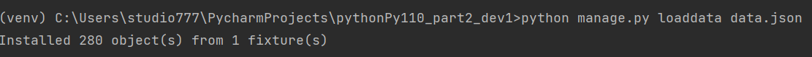

Теперь все данные перенесены в новую БД.
На число объектов не обращайте внимание, так как возможно в вашей БД было больше 
сущностей или меньше.

Если запустить сервер, то теперь общение с БД идёт через PosgreSQL. Теперь 
можно заметить, что отработка запросов стала намного медленнее, это стоило ожидать, 
так как БД не рядом и запрос идёт долго. Но теперь БД на другом сервисе, а это
значит, что мы разделили уязвимые части (если сервер с приложением перестанет работать,
то база данных будет работать, так ка она на другом сервере и можно быстро поднять 
приложение)

Немного для практики ещё поработаем с БД. Ранее мы делали слепок(dumpdata) нашей 
БД, и потом заново загружали данные в БД(loaddata). Теперь же повторим, 
что у нас было ранее, т.е. удалим базу и заново при помощи скрипта всё создадим,
но уже это будет удаленная база PosgreSQL.

Для этого:

1. Удалим БД. В Django вы можете удалить базу данных с использованием команды 
```python 
python manage.py flush
```
После выполнения команды соглашаемся с удалением данных. Эта команда удаляет все данные из базы данных, оставляя структуру таблиц и схему 
неизменными. Она также снова применяет все миграции, создавая чистую базу данных.

2. Удалим папку `products` из `media`, чтобы не дублировались 
картинки продуктов при новой записи.


3. Запускаем скрипт `filling_database.py`

```python
python filling_database.py
```

Создание данных теперь занимает дольше времени. Но когда всё закончится, то
функциональность приложения не нарушится. Приложение должно быть рабочим, а база
данных находится на сервисе `render`

Следующая часть, это деплой приложения на сервис рендер.

## 4. Деплой приложения 

Занесём в переменные среды `requirements.txt`

```python
pip freeze > requirements.txt
```

`Делаем коммит и пуш на github`

Заходим на Dashboard и выбираем новый веб сервис

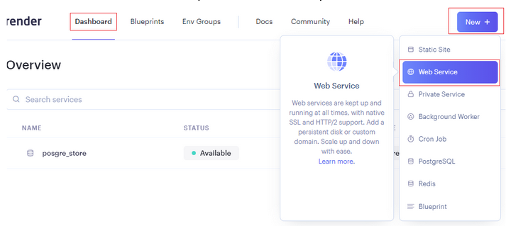

Выбираем `Build and deploy from a Git repository`

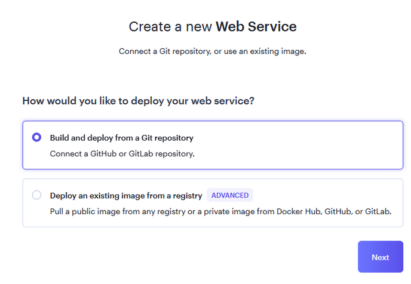

Присоединяем свой аккаунт на github

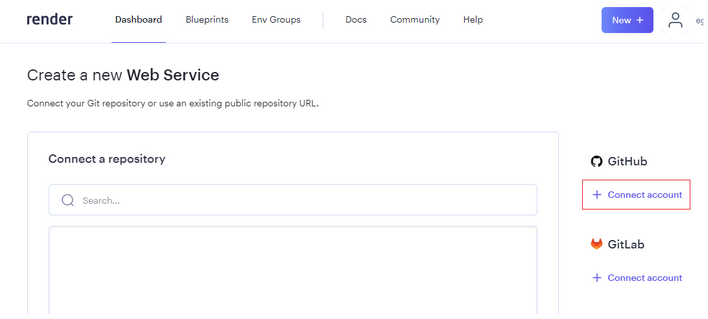

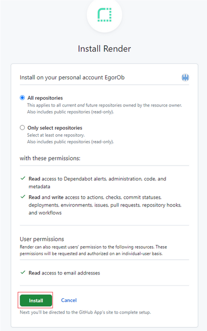

Собираем на базе вашего проекта на github (что недавно коммитили и пушили)

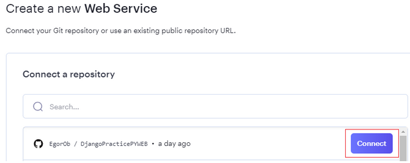

Далее необходимо настроить проект

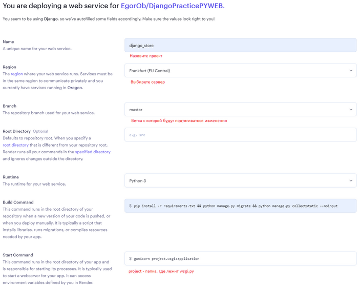

В Build Command пропишем

```python
pip install -r requirements.txt && python manage.py migrate && python manage.py collectstatic --noinput
```

Команда collectstatic будет нужна для сбора статических файлов каждый раз как будет собираться проект перед деплоем. Тут аналогичная ситуация поднимается контейнер в котором собирается и запускается проект.

В Start Command пропишем

```python
gunicorn project.wsgi:application
```

Выбираем бесплатный вариант

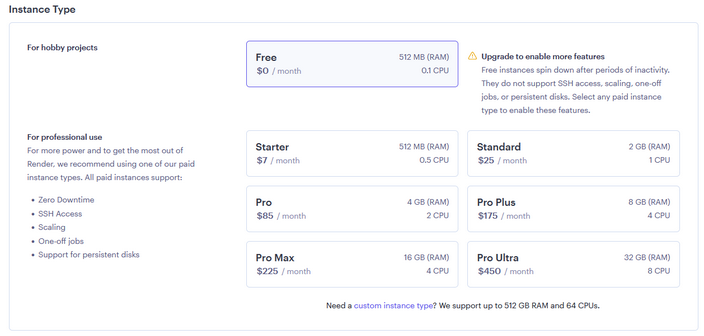

В блоке Environment Variables добавим переменные окружения

Пропишем там версию питона на которой будем разворачивать (особенности сервиса предполагают использование python 3.7 по умолчанию), у меня это 3.11.5. Поставьте свою версию на которой собирали, чтобы не было конфликтов. Посмотреть какой у вас python просто, достаточно в консоли где у вас загружена env среда прописать 
python ––version

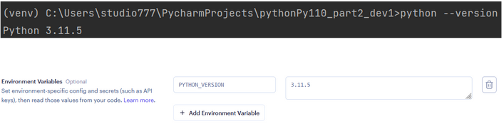

Далее в самом низу будут расширенные настройки, где будет возможность создать или переменные окружения или env файл с настройками.

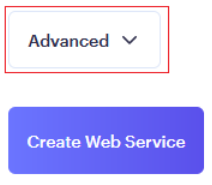

Выберем Add Secret File

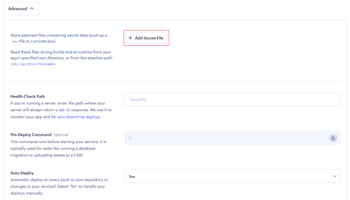

Скопируйте всё, что есть в вашем файле .env локального проекта(последние изменения с БД posgreSQL с сервиса), 
в ALLOWED_HOSTS можно поставить *, позже заменим на нужный хост. 
Debug поставьте в false, чтобы запустить как в продакшн режиме.

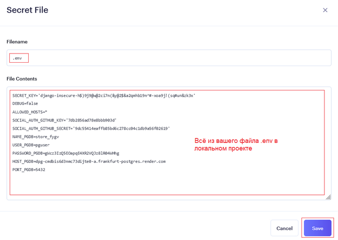

Сохраняем и создаём проект

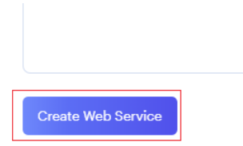

Далее появится консоль с трассировкой этапов развёртки, где можно наблюдать как идёт процесс

У меня развертка приложения заняла чуть больше двух минут

Далее если нажать на название сайта, то откроется ваше приложение, если всё настроено верно то будут отображены все статические файлы.

Видно, что протокол передачи сразу защищенный https

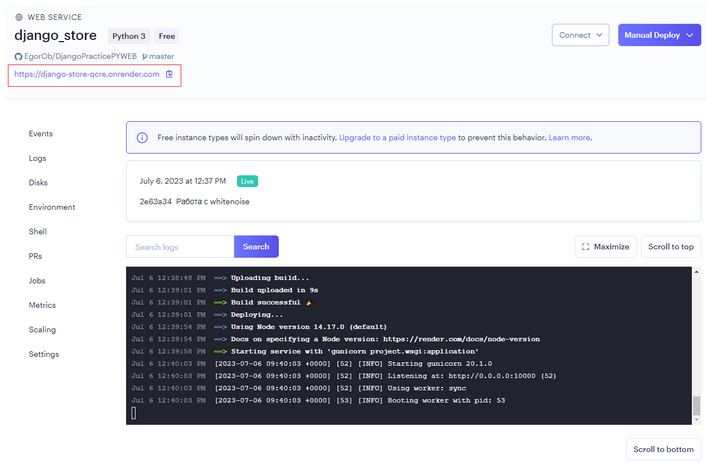

Благодаря хостингу whitenoise статические файлы отображаются 
без режима дебаг (кроме медиафайлов)

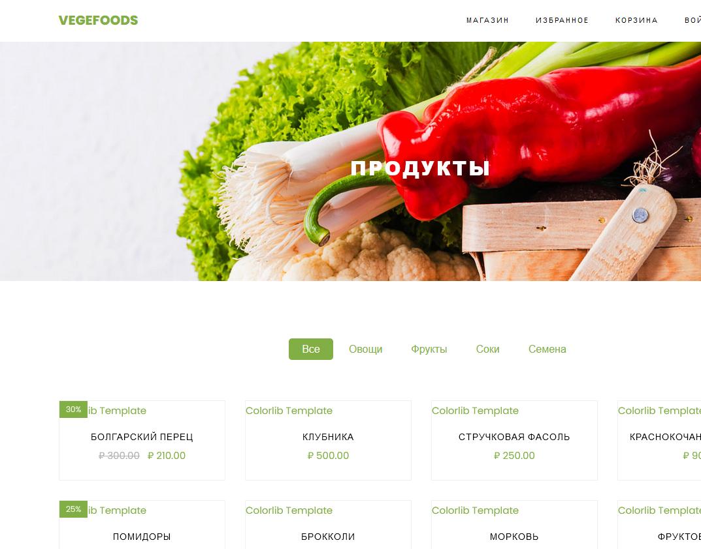


# 5. Переключение на debug

Последнее что сделаем по знакомству с сервисом, это вызовем неправильную ссылку на нашем сайте, чтобы получить ошибку 404, затем зайдём в enviroments поменяет debug на true, посмотрим что сервис самостоятельно начал пересобирать bild и запускать сайт.

Вызов некорректной работы

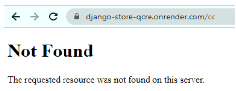

В environments обновите .env файл 

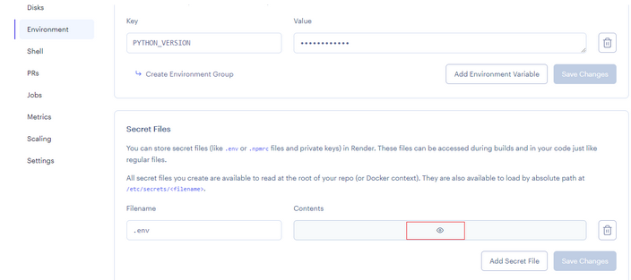

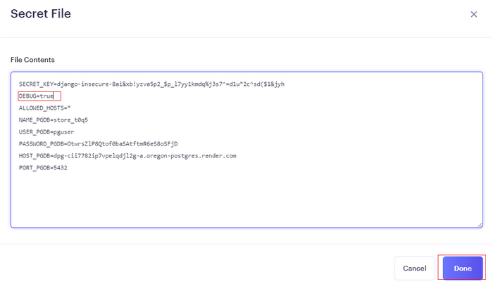

И затем обязательно необходимо сохранить изменения

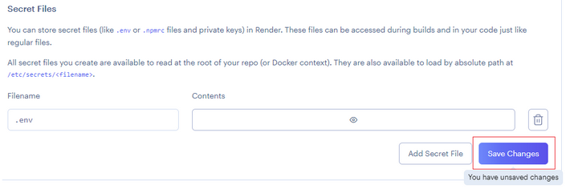

Затем можно зайти в Events и увидеть что сборка пошла самостоятельно от изменения настроек, если нажать на deploy, то перекинет на консоль где можно будет посмотреть за процессом сборки

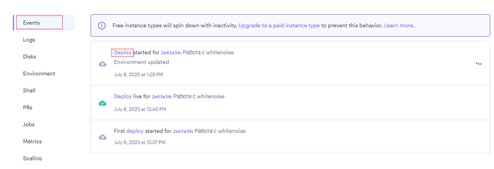

Зеленое облако говорит об удачной развёртке, а кнопка справа Rollback позволяет откатить состояние развертки до данного удачного состояния.

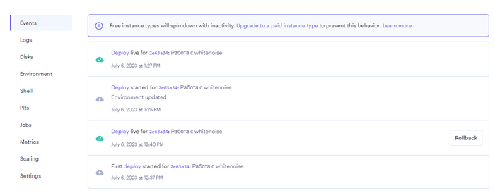

Если зайти на сайт, то ничего не изменится, всё отображается (и на том спасибо), но если перейти на неправильную ссылку, то уже покажет стандартное окно отладки, значит debug работает.

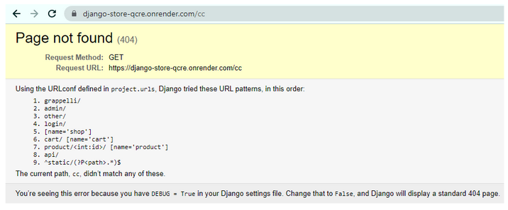

А уже основная страница подгружена со статикой и медиафайлами.


# Практика окончена
